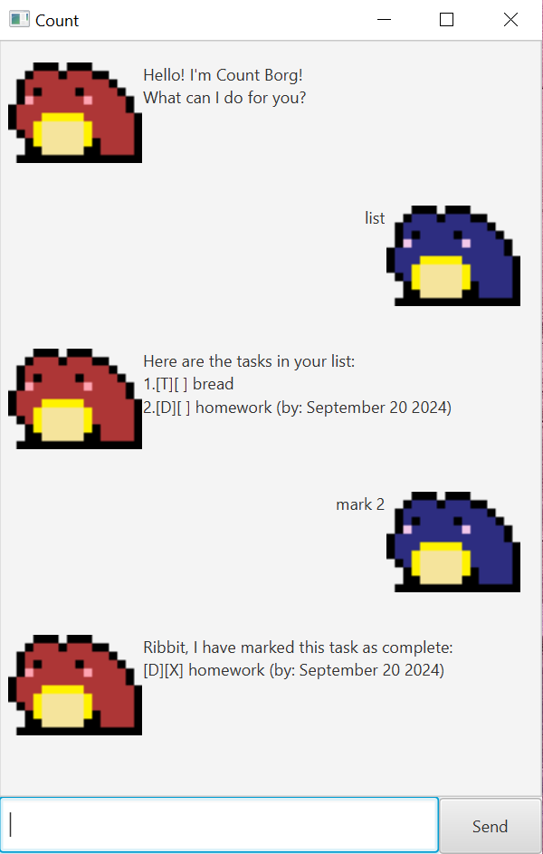

# Count User Guide

## How do I install and run Count?
# Using CLI
1: Download Count.jar from the releases page  
2: Navigate to the directory containing the JAR file (Optional: make a new directory for it)  
3: Run the jar file with the following command
```
java -jar count.jar
```
# On Desktop (Windows/Mac)
1: Download Count.jar from the releases page  
2: Place it in a folder (This is where your tasks will be saved and loaded from)  
3: Open it!  

Check that you have Java installed in order to use Count!



Welcome to Count, your new digital assistant here to help streamline your day!  
Now with innovative functions such as a built-in task list, you can effortlessly manage and track your tasks and deadlines,  
ensuring nothing slips through the cracks.

## How do I use Count?

This readme serves as the documentation guide for how to talk to Count Borg!  
But you could always just ask the amphibian himself.

Template: `help`

```
1.'hello': Prompts me for a greeting!
Usecase: hello
.
.
.
10.'remind': Reminds the user what tasks are due in within the specified number of days.
Usecase: remind 7
```

## Adding a To-Do Task

A to-do task would be a non-pressing task with no fixed due date.  
An example would be something basic like, buy bread for a snack

Template: `todo buy bread for a snack`

Count Borg will then add it to your task list!

```
Ribbit, added the following task:
[T][ ] buy bread for a snack
You now have 1 task(s) in your list
```

## Adding a Deadline Task

A deadline task as it's name suggests, has a do-by-date.  
An example would be something like, homework due on 20th October 2024

Template: `deadline do homework /by 20/10/2024`

```
Ribbit, added the following task:
[D][ ] do homework (by: October 20 2024)
You now have 2 task(s) in your list
```

## Adding an Event Task

An Event task is one that runs from a start time, to an end time.  
An example would be something like,
a holiday overseas from 10th September 2024 to 17th September 2024

Template: `event on Holiday! /from 10/09/2024 /to 17/09/2024`

```
Ribbit, added the following task:
[E][ ] on Holiday! (from: September 10 2024 to: September 17 2024)
You now have 3 task(s) in your list
```

## Seeing what is on the Task List

To view all tasks added to Count, it's as simple as just asking!

Template: `list`

```
Here are the tasks in your list:
1.[T][ ] buy bread for a snack
2.[D][ ] do homework (by: October 20 2024)
3.[E][ ] on Holiday! (from: September 10 2024 to: September 17 2024)
```

## Mark a Task as Complete

Done with a task? Mark it as done!  
For example, if you are done buying bread...

Template: `mark 1`

```
Ribbit, I have marked this task as complete:
[T][X] buy bread for a snack
```

## Mark a Task as Incomplete

Maybe not done yet?  
For example, if you mistakenly marked buying bread as complete...

Template: `unmark 1`

```
Ribbit, I have marked this task as incomplete:
[T][ ] buy bread for a snack
```

## Save Tasks as a text file

Want to share your task list? Or maybe you just want to view it again later.  
Save your task list as a text file right next to the application.

Template: `save`

```
Ribbit, your list has been saved over at Count.txt
```

## Load Tasks from a text file

To view a task list, it's as simple as dropping it off next to the Count.jar  
Opening the application will load it right up as long as it is in the correct format!

## Find Tasks using keywords

Too much stuff on your plate? Sift through your task list using keywords with find!

Template: `find [keyword]`

```
Ribbit, here are the matching tasks in your list
1.[T][ ] buy bread for a snack
```

## Remind

Similarly, if you want to know what Deadlines and Events are due in n days, you can use remind

Template: `remind 7`

Finds all Deadlines and Events due within 7 days
For example, if today is September 10, 2024. Inputting "remind 7" will yield:

```
Here are the tasks due within 7 days
1.[E][ ] on Holiday! (from: September 10 2024 to: September 17 2024)
```

While "remind 50" would yield:

```
Here are the tasks due within 50 days
1.[D][ ] do homework (by: October 20 2024)
2.[E][ ] on Holiday! (from: September 10 2024 to: September 17 2024)
```
